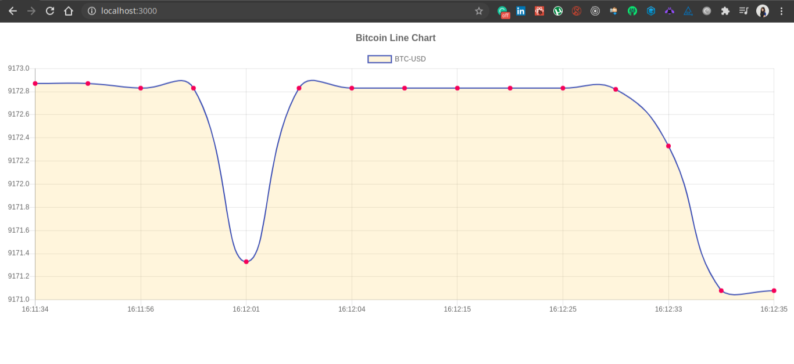

This chart is a realtime plot of bitcoin price.

### To run the app

1. #### `yarn install`

2. #### `yarn start`

Runs the app in the development mode. 
Open [http://localhost:3000](http://localhost:3000) to view it in the browser.

Deployed Link :  https://real-time-charts.netlify.app

### Functionalities Added

1. Realtime Chart
2. Use of Web Socket
3. Code Quality Improvement using Web Socket

### Tech Used

1. [Create React App](https://github.com/facebook/create-react-app).
2. Web Socket ()
3. chart.js
4. [ Coinbase API](https://docs.pro.coinbase.com/?r=1#time)

